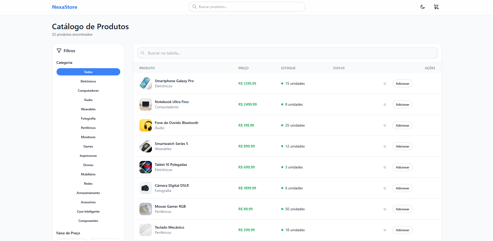
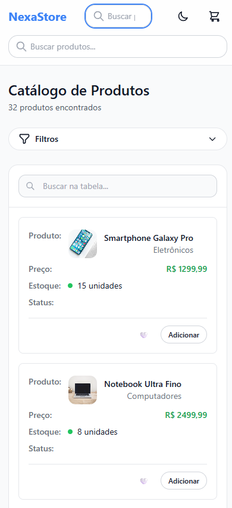

# 🛍️ NexaStore - Sistema de Gerenciamento de Produtos

**NexaStore** é uma aplicação moderna de catálogo de produtos desenvolvida em React com foco em experiência do usuário, responsividade e acessibilidade. O sistema oferece funcionalidades completas para visualização, busca, filtragem e gerenciamento de produtos em estoque.


*Vista desktop do catálogo de produtos*


*Interface responsiva para dispositivos móveis*

## ✨ Características Principais

- 🎨 **Design System Próprio**: Interface construída com Tailwind CSS e componentes customizados
- 📱 **Mobile-First**: Experiência otimizada para todos os dispositivos
- 🌓 **Tema Claro/Escuro**: Alternância entre temas com persistência local
- 🔍 **Busca Inteligente**: Busca em tempo real com debounce por nome e categoria
- 🏷️ **Sistema de Filtros**: Filtros por categoria, faixa de preço e disponibilidade
- ❤️ **Favoritos**: Sistema de marcação de produtos favoritos
- 🛒 **Carrinho**: Gerenciamento de itens no carrinho de compras
- ♿ **Acessível**: Navegação por teclado e compatibilidade com leitores de tela
- 📊 **DataTable Avançada**: Tabela com paginação, ordenação e ações inline

## 🚀 Tecnologias Utilizadas

- **React 18** - Biblioteca principal para construção da interface
- **Tailwind CSS** - Framework CSS utilitário para estilização
- **JavaScript ES6+** - Linguagem de programação
- **React Hooks** - Para gerenciamento de estado e efeitos
- **CSS Grid & Flexbox** - Para layouts responsivos
- **Local Storage** - Persistência de dados do usuário

## 🎯 Funcionalidades Implementadas

### 🔍 Sistema de Busca e Filtros
- Busca em tempo real por nome e categoria do produto
- Filtros por categoria de produto
- Filtro por faixa de preço (slider range)
- Filtro para produtos apenas em estoque
- Chips visuais para filtros ativos
- Botão para limpar todos os filtros

### 📱 Interface Responsiva
- Design mobile-first com breakpoints otimizados
- Layout adaptativo: grade de produtos (2 colunas mobile → 4 colunas desktop)
- Sidebar colapsável em mobile, fixa em desktop
- Componentes que se adaptam ao tamanho da tela

### 🎯 Gerenciamento de Produtos
- Visualização em formato de tabela com informações detalhadas
- Modal de detalhes do produto
- Sistema de favoritos com persistência local
- Adição de produtos ao carrinho
- Indicadores visuais de estoque disponível
- Badges de status (favorito, indisponível)

### 🌟 Experiência do Usuário
- Estados de loading com skeleton screens
- Toasts informativos para ações do usuário
- Animações suaves e feedback visual
- Tema escuro/claro com transições fluidas
- Paginação inteligente da tabela

## 🎨 Design System

### Princípios
- **Mobile-first**: Design responsivo priorizando dispositivos móveis
- **Clareza e foco**: Interface limpa priorizando descoberta de produtos
- **Consistência**: Design tokens e padrões de interação uniformes
- **Acessibilidade**: Semântica, navegação por teclado e contraste WCAG AA

### Componentes Implementados

#### UI Base
- `Button` - Botões com variantes primary, ghost e outline
- `Input` - Campos de entrada com suporte a ícones
- `Badge` - Elementos de identificação e contadores
- `Modal` - Modais com focus trap e acessibilidade
- `Skeleton` - Estados de carregamento
- `ProductCard` - Cartões de produtos com todas as interações

#### Layout
- `Layout` - Estrutura principal da aplicação com header integrado

#### Páginas
- `Catalog` - Catálogo completo com filtros, busca e DataTable avançada

## 📁 Estrutura do Projeto

```
src/
├── components/
│   ├── layout/
│   │   └── Layout.js          # Layout principal da aplicação
│   └── ui/
│       ├── Badge.js           # Componente de badges/etiquetas
│       ├── Button.js          # Botões customizáveis
│       ├── Input.js           # Campos de entrada
│       ├── Modal.js           # Componente de modal
│       ├── ProductCard.js     # Cartão de produto
│       └── Skeleton.js        # Loading states
├── data/
│   └── mockProducts.js        # Dados de exemplo dos produtos
├── hooks/
│   └── useTheme.js           # Hook para gerenciamento de tema
├── images/
│   ├── nexa-store-desktop.png # Screenshot da versão desktop
│   └── nexa-store-mobile.png  # Screenshot da versão mobile
├── pages/
│   └── Catalog.js            # Página principal do catálogo
├── utils/
│   └── favoriteStorage.js    # Utilitários para gerenciar favoritos
├── App.js                    # Componente raiz
└── index.js                  # Ponto de entrada da aplicação
```

## ⚡ Como Executar

### Pré-requisitos
- Node.js 16+ instalado
- npm ou yarn

### Instalação e Execução
```bash
# Clone o repositório
git clone [url-do-repositorio]

# Entre no diretório
cd nexa-store

# Instale as dependências
npm install

# Execute em modo de desenvolvimento
npm start
```

A aplicação estará disponível em `http://localhost:3000`

### Scripts Disponíveis
```bash
npm start          # Executa em modo desenvolvimento
npm run build      # Gera build de produção
npm test           # Executa testes
npm run eject      # Ejeta configurações (não recomendado)
```

## 🎨 Design System

O NexaStore utiliza um design system próprio baseado em tokens consistentes:

- **Cores**: Paleta neutra com tema escuro/claro
- **Tipografia**: Hierarquia clara e legível
- **Espaçamentos**: Sistema baseado em múltiplos de 4px
- **Bordas**: Cantos arredondados (rounded-2xl/3xl)
- **Sombras**: Aplicadas estrategicamente para profundidade
- **Estados**: Hover, focus e active states bem definidos

## 📋 Roadmap - O Que Faria com Mais Tempo

- [ ] Implementar lazy loading para imagens de produtos
- [ ] Otimizar bundle splitting e code splitting
- [ ] Implementar virtualização para listas grandes de produtos
- [ ] Integração com API REST real
- [ ] Sistema de autenticação e autorização
- [ ] Migração para TypeScript para maior robustez
- [ ] Busca com autocomplete e sugestões
- [ ] Filtros mais avançados (marca, tamanho, cor)

---

*Desenvolvido com ❤️ usando React e Tailwind CSS*